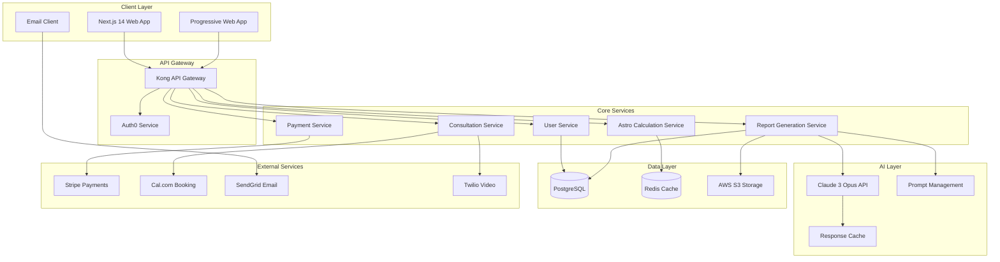

# StarClock.me - Production Deployment PRD
## *Translating Cosmic Wisdom into Personal Guidance*

---

## Executive Summary

StarClock.me is a premium astrological guidance platform that combines Swiss Ephemeris precision with AI-powered interpretations to deliver deeply personalized, multi-page astrological reports and services. The platform offers a tiered ecosystem from free cosmic blueprints to premium 1:1 consultations with certified astrologers, serving the growing market of spiritually-curious individuals seeking authentic cosmic guidance.

### Core Value Proposition
- **Accuracy First**: Swiss Ephemeris calculations with arc-second precision
- **Depth Over Breadth**: Multi-page reports with nuanced, contextual interpretations
- **Human + AI Synergy**: AI-generated insights validated by professional astrologers
- **Accessible Mysticism**: Complex astrological concepts translated into actionable guidance

---

## 1. Product Vision & Success Metrics

### Vision Statement
To become the trusted bridge between ancient astrological wisdom and modern seekers, providing scientifically-accurate cosmic calculations paired with deeply personal, actionable insights that guide users through life's journey.

### Success Metrics - Q1 2025
| Metric | Target | Measurement Method |
|--------|--------|-------------------|
| **User Acquisition** | 10,000 registered users | Database count |
| **Free-to-Paid Conversion** | 5% within 30 days | Cohort analysis |
| **Report Quality Score** | 4.7/5.0 average | Post-report survey |
| **Calculation Accuracy** | 100% (±0.001°) | Automated verification |
| **1:1 Consultation Bookings** | 200/month | Booking system |
| **Monthly Recurring Revenue** | $50,000 | Stripe dashboard |
| **User Retention (90-day)** | 65% active users | Analytics tracking |
| **Report Completion Rate** | 85% full read-through | Scroll tracking |
| **Social Shares** | 25% of paid reports | Share button analytics |
| **Support Tickets** | <2% of active users | Helpdesk metrics |

### North Star Metric
**Monthly Active Cosmic Explorers (MACE)**: Users who generate/view at least one report or book a consultation within 30 days

---

## 2. User Personas & Journey Maps

### Primary Personas

#### 1. The Cosmic Seeker (Free → Explorer Tier)
- **Profile**: Sarah, 32, Marketing Manager in Austin, TX
- **Astro Knowledge**: Knows sun sign, curious about moon/rising
- **Pain Points**: Generic horoscopes, wants personal guidance
- **Journey**:
  ```
  Google Search → Landing Page → Free Report → Daily Emails → 
  Mini Report Purchase → Explorer Subscription → Social Sharing
  ```
- **Success Moment**: "This explains why I've always felt different during full moons!"

#### 2. The Spiritual Navigator (Explorer → Navigator Tier)
- **Profile**: Michael, 45, Life Coach in Sedona, AZ
- **Astro Knowledge**: Understands houses, aspects, transits
- **Pain Points**: Needs timing for major decisions, relationship insights
- **Journey**:
  ```
  Referral → Deep Dive Reports → Navigator Upgrade → 
  Transit Alerts → Premium Analysis → 1:1 Consultation
  ```
- **Success Moment**: "The Saturn return analysis helped me navigate my career transition perfectly."

#### 3. The Cosmic Professional (Navigator → Facilitator License)
- **Profile**: Luna, 38, Yoga Teacher & Wellness Coach, Portland, OR
- **Astro Knowledge**: Professional-level understanding
- **Pain Points**: Needs client tools, white-label reports
- **Journey**:
  ```
  Professional Network → Platform Evaluation → Navigator Trial → 
  Facilitator License → Client Portal → Bulk Report Generation
  ```
- **Success Moment**: "My clients love the branded reports - it's elevated my practice!"

#### 4. The Crisis Seeker (Direct to 1:1 Consultation)
- **Profile**: David, 52, Recently Divorced Executive, NYC
- **Astro Knowledge**: Skeptical but desperate for guidance
- **Pain Points**: Major life transition, needs human connection
- **Journey**:
  ```
  Friend Recommendation → Consultation Booking → 
  Pre-Session Report → 1:1 Session → Follow-up Reports
  ```
- **Success Moment**: "The astrologer helped me understand this was a transformative period, not just chaos."

---

## 3. Core Features & Specifications

### 3.1 Astrological Calculation Engine

#### Technical Requirements
```yaml
engine:
  core: Swiss Ephemeris v2.10
  precision: 
    - planetary_positions: ±0.001 arc seconds
    - house_cusps: Placidus, Whole Sign, Equal options
    - aspects: Exact to 0.01°
  
  calculations:
    - natal_chart: Full 12 houses, 10 planets + nodes
    - progressions: Secondary, Solar Arc
    - transits: Current + future (up to 2 years)
    - synastry: Composite and Davison charts
    - returns: Solar, Lunar, Planetary
    
  special_points:
    - asteroids: Chiron, Vesta, Pallas, Juno, Ceres
    - arabic_parts: Fortune, Spirit, Eros
    - fixed_stars: 1st magnitude stars with 1° orb
    
  ephemeris_data:
    range: 1800-2100 CE
    update_frequency: Monthly verification
    backup_source: JPL Horizons for verification
```

#### Calculation Verification
- Every chart calculation must pass triple verification:
  1. Swiss Ephemeris primary calculation
  2. Internal consistency check (aspects sum validation)
  3. Spot verification against established ephemeris tables

### 3.2 Report Generation System

#### Report Specifications
```yaml
report_types:
  free_cosmic_blueprint:
    length: 15-20 pages
    sections:
      - executive_summary: 1 page life overview
      - sun_analysis: 2-3 pages core identity
      - moon_analysis: 2-3 pages emotional nature
      - rising_analysis: 2 pages life approach
      - planetary_overview: 5-6 pages major planets
      - life_themes: 2-3 pages synthesized insights
      - next_steps: 1 page upgrade paths
    
  mini_deep_dive:
    length: 8-12 pages
    topics:
      - love_relationships: Venus/Mars/7th house focus
      - career_calling: MC/10th house/Saturn analysis
      - spiritual_path: Neptune/12th house/Node axis
      - wealth_resources: 2nd/8th house/Jupiter focus
      - health_vitality: 6th house/Virgo/vital points
    personalization: Birth chart overlay required
    
  premium_analysis:
    length: 25-35 pages
    types:
      - saturn_return: Complete 29.5-year cycle analysis
      - relationship_composite: Two-chart synthesis
      - year_ahead_forecast: Month-by-month transits
      - relocation_astrology: Astrocartography analysis
      - past_life_karmic: Nodal axis deep dive
    features:
      - visual_charts: 5-8 professional diagrams
      - timing_calendar: Exact dates for transits
      - action_recommendations: Specific guidance
```

#### AI Prompt Architecture
```python
# Master prompt structure for report generation
base_prompt = {
    "role": "expert_astrologer",
    "experience": "30_years",
    "style": "compassionate_wisdom",
    "components": {
        "calculation_data": swiss_ephemeris_output,
        "interpretation_framework": "evolutionary_astrology",
        "language_level": user_preference, # technical/accessible
        "report_section": current_section,
        "user_context": {
            "age": calculated_from_birth,
            "life_phase": determined_by_transits,
            "previous_reports": reference_for_consistency
        }
    },
    "quality_requirements": {
        "length": section_specific_word_count,
        "depth": "multilayered_interpretation",
        "practical": "minimum_3_actionable_insights",
        "tone": "empowering_not_predictive"
    }
}
```

### 3.3 1:1 Consultation Platform

#### Consultation Service Tiers
```yaml
consultation_services:
  discovery_session:
    duration: 30 minutes
    price: $97
    includes:
      - pre_session_report: 10-page natal overview
      - live_chart_review: Screen share enabled
      - recording: Audio + visual chart markup
      - follow_up: 3-page action summary
    
  deep_dive_session:
    duration: 60 minutes
    price: $197
    includes:
      - comprehensive_prep: 20-page analysis
      - live_exploration: Interactive chart work
      - transit_timing: Next 6 months mapped
      - follow_up: 5-page integration guide
      - email_support: 2 follow-up questions
    
  transformation_package:
    duration: 3 x 60 minutes
    price: $497
    timeline: Over 6 weeks
    includes:
      - initial_mapping: Complete life analysis
      - progress_sessions: Bi-weekly deep dives
      - unlimited_reports: All report types included
      - priority_support: 48-hour email response
      - integration_homework: Custom exercises
```

#### Astrologer Network
```yaml
astrologer_requirements:
  certification: 
    - ISAR_certified OR
    - 5_years_professional_practice
    - platform_training_completion
  
  specializations:
    - evolutionary_astrology
    - traditional_hellenistic  
    - psychological_astrology
    - mundane_world_events
    - medical_astrology
    - financial_astrology
    
  quality_assurance:
    - client_rating_minimum: 4.5/5.0
    - session_recording_review: Monthly
    - continuing_education: 10 hours/year
    
  revenue_share:
    - platform_fee: 30%
    - astrologer_earning: 70%
    - payment_schedule: Weekly ACH transfer
```

### 3.4 Daily Astro-Weather System

#### Email Specifications
```yaml
daily_email:
  generation_time: 4:00 AM user_timezone
  personalization_depth: 
    - exact_transit_aspects: Within 1° orb
    - house_activation: Based on natal chart
    - lunar_phase: Exact degree calculation
    
  content_structure:
    header: 
      - date_cosmic_weather: "Monday's Cosmic Climate"
      - personal_moon_phase: User's progressed moon
    
    main_content:
      - daily_theme: 150-200 words
      - personal_transits: 2-3 most significant
      - timing_windows: Exact times for aspects
      - practical_guidance: 3 specific actions
      
    cta_rotation:
      - monday: Mini report spotlight
      - tuesday: Consultation testimonial  
      - wednesday: Educational content
      - thursday: Premium report feature
      - friday: Weekend transit preview
      - weekend: Upgrade benefits
```

---

## 4. Technical Architecture & Infrastructure

### 4.1 System Architecture



### 4.2 Technology Stack

```yaml
frontend:
  framework: Next.js 14 with App Router
  ui_library: Tailwind CSS + Radix UI
  state_management: Zustand
  animations: Framer Motion
  charts: D3.js for astrological charts
  
backend:
  runtime: Node.js 20 LTS
  framework: NestJS
  orm: Prisma
  queue: BullMQ
  cache: Redis
  
infrastructure:
  hosting: Vercel (Frontend) + AWS ECS (Backend)
  database: AWS RDS PostgreSQL
  storage: AWS S3 + CloudFront CDN
  monitoring: DataDog
  error_tracking: Sentry
  
security:
  authentication: Auth0
  encryption: AES-256 for PII
  compliance: SOC 2 Type II
  backup: Daily automated backups
```

### 4.3 Database Schema

```sql
-- Core user data with privacy focus
CREATE TABLE users (
    id UUID PRIMARY KEY DEFAULT gen_random_uuid(),
    email VARCHAR(255) UNIQUE NOT NULL,
    auth0_id VARCHAR(255) UNIQUE NOT NULL,
    created_at TIMESTAMPTZ DEFAULT NOW(),
    updated_at TIMESTAMPTZ DEFAULT NOW(),
    subscription_tier VARCHAR(50) DEFAULT 'free',
    consultation_credits INTEGER DEFAULT 0,
    referral_code VARCHAR(20) UNIQUE,
    referred_by UUID REFERENCES users(id),
    lifecycle_stage VARCHAR(50) DEFAULT 'activated'
);

-- Encrypted birth data
CREATE TABLE birth_data (
    id UUID PRIMARY KEY DEFAULT gen_random_uuid(),
    user_id UUID REFERENCES users(id) ON DELETE CASCADE,
    encrypted_birth_datetime TEXT NOT NULL, -- AES-256 encrypted
    encrypted_birth_location TEXT NOT NULL, -- AES-256 encrypted
    lat_lng_hash VARCHAR(64) NOT NULL, -- For quick geocoding cache
    timezone VARCHAR(50) NOT NULL,
    dst_offset INTEGER NOT NULL,
    rodden_rating CHAR(2) DEFAULT 'AA', -- Birth time accuracy
    created_at TIMESTAMPTZ DEFAULT NOW()
);

-- Comprehensive report storage
CREATE TABLE reports (
    id UUID PRIMARY KEY DEFAULT gen_random_uuid(),
    user_id UUID REFERENCES users(id) ON DELETE CASCADE,
    report_type VARCHAR(50) NOT NULL,
    report_version VARCHAR(10) NOT NULL,
    calculation_data JSONB NOT NULL, -- Raw Swiss Ephemeris output
    generated_content JSONB NOT NULL, -- Structured report content
    pdf_url TEXT,
    word_count INTEGER NOT NULL,
    generation_time_ms INTEGER NOT NULL,
    quality_score DECIMAL(3,2), -- Internal quality metric
    user_rating INTEGER CHECK (user_rating >= 1 AND user_rating <= 5),
    shared_count INTEGER DEFAULT 0,
    created_at TIMESTAMPTZ DEFAULT NOW(),
    accessed_at TIMESTAMPTZ DEFAULT NOW()
);

-- Consultation booking and history
CREATE TABLE consultations (
    id UUID PRIMARY KEY DEFAULT gen_random_uuid(),
    client_id UUID REFERENCES users(id) ON DELETE CASCADE,
    astrologer_id UUID REFERENCES users(id) ON DELETE CASCADE,
    scheduled_at TIMESTAMPTZ NOT NULL,
    duration_minutes INTEGER NOT NULL,
    service_type VARCHAR(50) NOT NULL,
    status VARCHAR(50) DEFAULT 'scheduled',
    video_room_url TEXT,
    recording_url TEXT,
    prep_report_id UUID REFERENCES reports(id),
    followup_report_id UUID REFERENCES reports(id),
    client_rating INTEGER CHECK (client_rating >= 1 AND client_rating <= 5),
    client_feedback TEXT,
    astrologer_notes TEXT, -- Encrypted
    amount_cents INTEGER NOT NULL,
    platform_fee_cents INTEGER NOT NULL,
    created_at TIMESTAMPTZ DEFAULT NOW(),
    completed_at TIMESTAMPTZ
);

-- Detailed subscription management
CREATE TABLE subscriptions (
    id UUID PRIMARY KEY DEFAULT gen_random_uuid(),
    user_id UUID REFERENCES users(id) ON DELETE CASCADE,
    stripe_subscription_id VARCHAR(255) UNIQUE,
    tier VARCHAR(50) NOT NULL,
    status VARCHAR(50) NOT NULL,
    current_period_start TIMESTAMPTZ NOT NULL,
    current_period_end TIMESTAMPTZ NOT NULL,
    cancel_at_period_end BOOLEAN DEFAULT FALSE,
    reports_used INTEGER DEFAULT 0,
    reports_limit INTEGER NOT NULL,
    premium_analyses_used INTEGER DEFAULT 0,
    premium_analyses_limit INTEGER NOT NULL,
    created_at TIMESTAMPTZ DEFAULT NOW(),
    updated_at TIMESTAMPTZ DEFAULT NOW()
);

-- Calculation accuracy verification log
CREATE TABLE calculation_verifications (
    id UUID PRIMARY KEY DEFAULT gen_random_uuid(),
    report_id UUID REFERENCES reports(id) ON DELETE CASCADE,
    calculation_type VARCHAR(50) NOT NULL,
    primary_result JSONB NOT NULL,
    verification_result JSONB NOT NULL,
    difference_arc_seconds DECIMAL(10,6),
    passed BOOLEAN NOT NULL,
    verified_at TIMESTAMPTZ DEFAULT NOW()
);

-- Create indexes for performance
CREATE INDEX idx_users_email ON users(email);
CREATE INDEX idx_users_subscription_tier ON users(subscription_tier);
CREATE INDEX idx_birth_data_user_id ON birth_data(user_id);
CREATE INDEX idx_reports_user_id_created ON reports(user_id, created_at DESC);
CREATE INDEX idx_consultations_client_scheduled ON consultations(client_id, scheduled_at);
CREATE INDEX idx_consultations_astrologer_scheduled ON consultations(astrologer_id, scheduled_at);
CREATE INDEX idx_subscriptions_user_status ON subscriptions(user_id, status);
```

---

## 5. User Experience & Design System

### 5.1 Design Principles

1. **Cosmic Elegance**: Deep space aesthetics with purple gradients, constellation patterns
2. **Sacred Geometry**: Golden ratio layouts, circular chart presentations
3. **Accessibility First**: WCAG AA compliance, high contrast options
4. **Mobile Optimized**: 60% of users on mobile, touch-first interactions
5. **Data Density**: Complex info presented in digestible layers

### 5.2 Key User Flows

#### New User Onboarding
```
Landing Page (Hero CTA)
    ↓
Email Capture (No password yet)
    ↓
Birth Data Form
  - Smart location autocomplete
  - Time zone auto-detection  
  - "I don't know exact time" option
    ↓
Report Generation (Live progress)
  - "Calculating your cosmic blueprint..."
  - Educational snippets while waiting
    ↓
Report Presentation
  - Interactive chart
  - Guided tour overlay
  - Share buttons prominent
    ↓
Upsell Moment
  - "Unlock deeper insights"
  - Show report preview
  - One-click upgrade
```

#### Returning User Dashboard
```
Login (Magic link or Auth0)
    ↓
Personalized Dashboard
  - Today's cosmic weather
  - Active transits wheel
  - Report library
  - Consultation history
    ↓
Quick Actions
  - Generate new report
  - Book consultation
  - Share recent insight
  - Refer friend (incentive)
```

### 5.3 Report Interface Design

```yaml
report_ui:
  header:
    - user_name_greeting: "Sarah's Cosmic Blueprint"
    - generation_date_time: With current planetary positions
    - interactive_chart: Clickable planets for deep dives
    
  navigation:
    - sticky_toc: Collapsible chapter navigation
    - progress_indicator: Reading progress bar
    - bookmark_feature: Save specific sections
    
  content_presentation:
    - typography: 
        - headers: "Philosopher" font
        - body: System font stack for readability
        - quotes: Italic with constellation border
    - spacing: 1.6x line height, generous margins
    - highlights: Key insights in branded purple boxes
    
  interactivity:
    - planet_hover: Show aspect lines on chart
    - term_tooltips: Hover for definitions
    - audio_option: AI voice reading (premium)
    
  sharing:
    - section_shares: Share specific insights
    - chart_export: High-res PNG download
    - social_templates: Pre-formatted posts
```

---

## 6. Monetization & Pricing Strategy

### 6.1 Pricing Tiers

| Tier | Price | Features | Target User | Conversion Goal |
|------|-------|----------|-------------|-----------------|
| **Free** | $0 | • Basic Cosmic Blueprint (15 pages)<br>• Daily Astro-Weather emails<br>• 1 chart calculation/month | Cosmic-curious beginners | 5% to paid within 30 days |
| **Stellar** | $3 one-time | • Full terminology in reports<br>• Unlimited chart views<br>• PDF downloads | Engaged free users | 40% purchase rate |
| **Explorer** | $12/month | • 4 standard reports/month<br>• All mini deep-dives<br>• Report archive<br>• Priority support | Regular seekers | 60% retention at 6 months |
| **Navigator** | $29/month | • Unlimited reports<br>• 2 premium analyses/month<br>• Transit alerts<br>• 20% consultation discount | Serious practitioners | 75% retention at 6 months |
| **Facilitator** | $97/month | • White-label reports<br>• Client management<br>• Bulk generation<br>• API access<br>• 50% consultation discount | Professionals | 85% annual retention |

### 6.2 Consultation Pricing

| Service | Duration | Price | Commission | Net to Astrologer |
|---------|----------|-------|------------|-------------------|
| Discovery | 30 min | $97 | 30% | $67.90 |
| Deep Dive | 60 min | $197 | 30% | $137.90 |
| Transformation | 3x60 min | $497 | 30% | $347.90 |
| Emergency | 30 min | $147 | 25% | $110.25 |

### 6.3 Revenue Projections

```yaml
month_1:
  users: 2,000
  conversions:
    stellar_upgrades: 100 × $3 = $300
    explorer_subs: 50 × $12 = $600
    navigator_subs: 10 × $29 = $290
    consultations: 20 × $147 avg = $2,940
  total: $4,130

month_6:
  users: 10,000
  conversions:
    stellar_upgrades: 500 × $3 = $1,500
    explorer_subs: 300 × $12 = $3,600
    navigator_subs: 100 × $29 = $2,900
    facilitator_subs: 20 × $97 = $1,940
    consultations: 200 × $147 avg = $29,400
  total: $39,340
  
month_12:
  users: 25,000
  conversions:
    stellar_upgrades: 1,000 × $3 = $3,000
    explorer_subs: 1,000 × $12 = $12,000
    navigator_subs: 400 × $29 = $11,600
    facilitator_subs: 100 × $97 = $9,700
    consultations: 500 × $147 avg = $73,500
  total: $109,800
```

---

## 7. Launch Strategy & Go-to-Market

### 7.1 Pre-Launch (Weeks -4 to 0)

1. **Beta Testing Program**
   - 100 beta users from astrology communities
   - Free Navigator access for detailed feedback
   - Report quality verification
   - Calculation accuracy audit

2. **Content Creation**
   - 50 SEO-optimized articles on astrology topics
   - Sample report PDFs for social sharing
   - Astrologer partnership program setup
   - Influencer outreach kit

3. **Technical Preparation**
   - Load testing to 10,000 concurrent users
   - Redundancy verification
   - Security audit completion
   - GDPR/CCPA compliance check

### 7.2 Launch Week Strategy

```yaml
day_1_soft_launch:
  - Enable registration for waitlist users
  - Monitor system performance
  - Gather initial feedback
  - Fix critical issues

day_3_influencer_push:
  - Astrology influencer partnerships go live
  - Sponsored content on spiritual podcasts
  - Reddit AMA in r/astrology
  - TikTok astrology creators activated

day_5_public_launch:
  - Press release to spiritual/wellness media
  - Product Hunt launch
  - Email blast to 50k wellness newsletter
  - Paid social campaigns begin

day_7_optimization:
  - A/B test results analysis
  - Conversion funnel optimization
  - Support ticket pattern analysis
  - First week metrics review
```

### 7.3 Post-Launch Growth

1. **Month 1: Foundation**
   - Daily social content cadence
   - Weekly astrology webinars
   - Referral program launch
   - SEO content publication

2. **Month 2-3: Expansion**
   - Affiliate program for wellness coaches
   - Partnership with meditation apps
   - Astrology course creators integration
   - Corporate wellness packages

3. **Month 4-6: Optimization**
   - Premium feature development based on feedback
   - International astrology traditions added
   - Mobile app development begins
   - B2B platform for wellness centers

---

## 8. Operations & Support

### 8.1 Customer Support Structure

```yaml
support_tiers:
  tier_1_self_service:
    - comprehensive_faq: 100+ articles
    - video_tutorials: Report navigation, chart reading
    - community_forum: User-to-user support
    
  tier_2_chat_support:
    - hours: 9 AM - 9 PM EST
    - response_time: <2 minutes
    - topics: Technical, billing, basic astrology
    
  tier_3_email_support:
    - response_time: <24 hours
    - topics: Complex issues, refunds, complaints
    
  tier_4_astrologer_support:
    - for: Navigator+ subscribers
    - response_time: <48 hours
    - topics: Report interpretation questions
```

### 8.2 Quality Assurance

1. **Report Quality**
   - Every 100th report human-reviewed
   - AI prompt effectiveness tracking
   - User satisfaction surveys post-report
   - Continuous prompt optimization

2. **Calculation Accuracy**
   - Daily verification against JPL Horizons
   - Monthly Swiss Ephemeris updates
   - Automated discrepancy alerts
   - Quarterly accuracy audits

3. **Astrologer Quality**
   - Session recordings review (with consent)
   - Client satisfaction tracking
   - Continuous education requirements
   - Peer review program

---

## 9. Risk Mitigation & Contingencies

### 9.1 Technical Risks

| Risk | Impact | Mitigation |
|------|--------|------------|
| Swiss Ephemeris failure | Critical | Fallback to JPL Horizons API |
| AI API downtime | High | Claude → GPT-4 → Cached responses |
| Database corruption | Critical | 15-min backups, multi-region replicas |
| DDoS attack | High | Cloudflare protection, rate limiting |
| Payment processing failure | High | Stripe → PayPal → Crypto options |

### 9.2 Business Risks

| Risk | Impact | Mitigation |
|------|--------|------------|
| Low conversion rates | High | A/B testing, pricing experiments |
| Astrologer shortage | Medium | Proactive recruiting, training program |
| Regulatory changes | Medium | Legal counsel, compliance budget |
| Competition from AI tools | High | Focus on accuracy + human touch |
| Seasonal demand dips | Medium | Southern hemisphere expansion |

### 9.3 Reputation Risks

1. **Accuracy Complaints**
   - Public accuracy guarantee with refunds
   - Transparent calculation methodology
   - Expert astrologer review board

2. **Privacy Concerns**
   - Clear data usage policies
   - Encryption for all birth data
   - Regular security audits published

3. **Prediction Liability**
   - Clear disclaimers on all reports
   - Focus on guidance vs prediction
   - Insurance policy for claims

---

## 10. Success Criteria & Exit Strategy

### 10.1 Success Milestones

**Year 1**: 
- 25,000 active users
- $100k MRR
- 4.5+ star average rating
- 500+ consultations/month

**Year 2**:
- 100,000 active users
- $500k MRR  
- Mobile app launched
- International expansion (3 languages)

**Year 3**:
- 250,000 active users
- $1.5M MRR
- B2B wellness platform
- Acquisition conversations

### 10.2 Potential Exit Scenarios

1. **Strategic Acquisition**
   - Target: Wellness platforms (Calm, Headspace)
   - Valuation: 10x ARR
   - Timeline: Year 3-5

2. **Private Equity**
   - Target: Spiritual/wellness roll-up
   - Valuation: 8x ARR
   - Timeline: Year 4-6

3. **IPO Path**
   - Requirement: $50M ARR
   - Multiple revenue streams
   - International presence
   - Timeline: Year 7-10

---

## Appendices

### A. Technical Specifications
[Detailed API documentation, calculation formulas, prompt templates]

### B. Legal Framework  
[Terms of service, privacy policy, astrologer agreements]

### C. Financial Projections
[5-year P&L, cash flow, unit economics]

### D. Competitive Analysis
[Feature comparison, pricing analysis, market positioning]

### E. Research & Validation
[User interviews, market research, beta test results]

---

*StarClock.me - Where the Cosmos Meets Consciousness*

**Document Version**: 1.0  
**Last Updated**: December 2024  
**Next Review**: January 2025  
**Owner**: Product Team